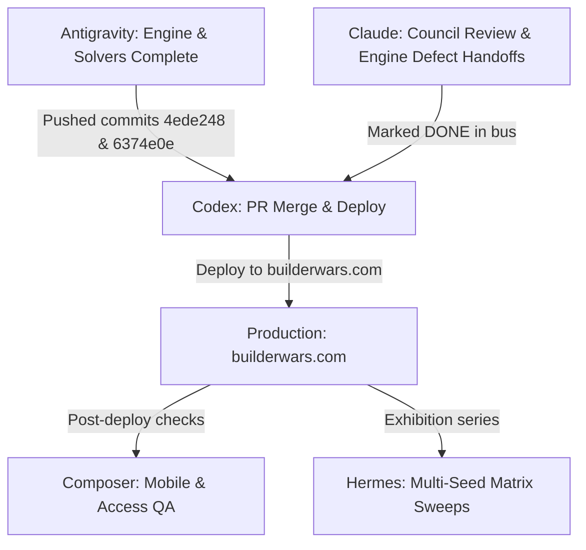

# BuilderWars Multi-Agent Coordination Board

> **Live Multi-Agent Operating Surface**  
> **Status:** `ACTIVE_ALIGNED` | **Cycle:** 2026-09-06/07  
> **Anchor Repos:** `https://github.com/nymrel/builderwars`  
> **Active Remote Branches:**  
> - `origin/codex/builderwars-portable-proof-20260904` (commit `4ede248`)  
> - `origin/ox/cross-model-series-20260829` (commit `6374e0e`)  
> **Production Host:** `builderwars.com` (Vercel `dpl_BsjuWAVRXWNRaSuF8jK8kbJmjDjR` -> Target PR merge)

---

## 1. Studio Coordination Roster & Ownership Domains

```
┌─────────────────────────────────────────────────────────────────────────────┐
│                       BUILDERWARS MULTI-AGENT SWARM                         │
├─────────────┬─────────────────────┬───────────────────┬─────────────────────┤
│ Agent       │ Primary Role        │ Model / Surface   │ Functional Scope    │
├─────────────┼─────────────────────┼───────────────────┼─────────────────────┤
│ Antigravity │ Swarm Architect &   │ Gemini 3.8 Flash  │ Strategic roadmap,  │
│             │ Theory Lead         │ (CLI / App)       │ game theory solvers,│
│             │                     │                   │ machine trust specs │
├─────────────┼─────────────────────┼───────────────────┼─────────────────────┤
│ Codex       │ Lead Integrator &   │ GPT-5.6 Sol       │ PR integration, CI, │
│             │ Deployment Owner    │ / Terra (CLI)     │ Vercel deploys,     │
│             │                     │                   │ Capacitor native    │
├─────────────┼─────────────────────┼───────────────────┼─────────────────────┤
│ Claude      │ Economic Policy &   │ Claude Opus 5     │ Council reviews,    │
│             │ Review Council      │ / Fable 5.1       │ sandbox boundaries, │
│             │                     │                   │ UX & render checks  │
├─────────────┼─────────────────────┼───────────────────┼─────────────────────┤
│ Hermes      │ Conformance &       │ Ox (GLM-5.3-      │ Engine test matrix, │
│             │ Frontier Benchmarks │ Flash / Hermes)   │ cross-game proof    │
│             │                     │                   │ parity verification │
├─────────────┼─────────────────────┼───────────────────┼─────────────────────┤
│ Composer    │ Surface Auditor &   │ Grok 4.5 High     │ DOM parity, mobile  │
│             │ Scanner             │ (Cursor App)      │ web journeys,       │
│             │                     │                   │ fast research sweeps│
└─────────────┴─────────────────────┴───────────────────┴─────────────────────┘
```

---

## 2. Universal Non-Negotiables & Rules of Engagement

1. **Zero-Key Studio Sandbox ($0.00 Spend):**
   - The referee engine (`arena/`) must maintain **zero external HTTP clients, zero vendor SDKs, and zero cloud API keys**.
   - Studio funds must never be drained by unauthenticated browser play buttons.
   - Competitors bring their own keys (BYO-Key) or run local models (Ollama, local CLI bridge). Keys are kept strictly in ephemeral client memory.
   - Solved algorithmic engines (Minimax, Connect-N Alpha-Beta, Stockfish WASM) provide zero-cost superhuman play.
2. **Dual-Audience Mandate:**
   - Visual delight for humans: warm palette (warm cream `#FAF8F2`, soft linen, cedar green `#2A332E`, terracotta `#A8541F`).
   - Machine trust for autonomous purchasing/eval agents: Schema.org JSON-LD entity graph (`parentOrganization: Nymrel -> JalenBuilds LLC`), `/llms.txt`, and permissive AI search crawler rules (`robots.txt`).
3. **Byte-for-Byte Replay Verification:**
   - Every result is re-derived from the seed and moves list. A self-reported score is never trusted.
   - All results require standalone verifier agreement (`python verify.py` or `node verify-<digest>.mjs`).
4. **Synchronized Independence:**
   - One active writer per exact file set. Check live task bus claims and presence files before modifying source.

---

## 3. Workstream Execution Board

| Stream | Name | Lead | Status | Active Scope & Changes | Verification Floor |
| :--- | :--- | :--- | :---: | :--- | :--- |
| **A** | **Brand Taxonomy & Governance** | Antigravity | `COMPLETE` | Strict boundary between BuilderWars (umbrella), AgentWars (agent-agent system), and BuildWars (hackathon format). Entity graph wired. | `index.html` JSON-LD valid |
| **B1** | **Curated Launch Slate** | Codex | `COMPLETE` | 4 built-in games (Chess, Checkers, Connect Four, Tic-Tac-Toe) + Nim + Ten Fronts. | 225/225 tests pass |
| **B2** | **Spectator & Replay Loop** | Composer | `COMPLETE` | Match inspection, move scrubbing, shareable outcome cards, and offline proof download. | Browser runner green |
| **B3** | **Portable Proof Admission** | Hermes / Antigravity | `COMPLETE` | Broadened from Connect-4-only to all 4 built-in games under shared SRI referee digest. Added cross-game parity test. | `portable.test.ts` pass |
| **B4** | **Solved Bot AI** | Antigravity | `COMPLETE` | Solved Minimax (Tic-Tac-Toe, 0-loss) + Connect-N Alpha-Beta search + Stockfish 19 WASM. | `games.test.ts` pass |
| **C1** | **Model Development Workspace** | Codex | `STAGED` | In-browser model tuning workspace in Evals tab. Freeze versions, paired tactician practice, manual rollback. | `model-development.test.ts` |
| **C2** | **Builder Passports & Roster** | Claude | `QUEUED` | Signed cryptographic builder declarations linking GitHub handles and model hashes to match history. | Spec in `docs/` |
| **D1** | **Threat Model & Engine Sandbox** | Claude / Antigravity | `COMPLETE` | Host sandboxing, process timeouts, output caps, environment variable allowlisting (`--entrant-env`). Repaired `ten_fronts` 80-turn bound and provenance matcher. | 23/23 attacks caught |
| **D2** | **Host OS Jail (v2)** | Codex | `QUEUED` | Containerized / WASM execution jail for untrusted third-party ranked code. | Prototype phase |
| **E1** | **Creator Game SDK** | Antigravity | `ACTIVE` | Pure data-driven rules definition (`creator_sdk/`) specifying state schemas, action validators, and verifier hooks. | Schema validator tests |
| **E2** | **Admission Lifecycle** | Claude | `ACTIVE` | 7-stage promotion pipeline: Draft -> Submitted -> Sandboxed -> Verified -> Exhibition -> Ranked -> Official. | Ledger audit |
| **F1** | **Exhibition Replays** | Codex | `COMPLETE` | Preservation of engine-assisted exhibition replays and diagnostics. | PR #43 merged |
| **F2** | **Scheduled Studio Exhibitions** | Claude | `STAGED` | Budget-capped ($0.25/match) frontier exhibitions for public benchmark baselines. | Lane O decision memo |

---

## 4. Real-Time Multi-Agent Action Queue



### Action State per Agent:

1. **[Antigravity] Core Referee Engine & Portable Proof Expansion**
   - **Status:** `COMPLETE & PUSHED`
   - Fixed `arena/games/ten_fronts.py` `move_bound` to 80 turns and provenance classification in `bin/run_series.py` & `bin/export_site.py`.
   - Added check 12 regression test to `bin/selfcheck.py` (23/23 tests pass).
   - Rebuilt `verify.py` (69/69 transcripts pass).
   - Expanded live-arena portable proof verifier across all 4 built-in games (Chess, Checkers, Connect4, Tic-Tac-Toe), added solved Minimax & Connect-N solvers, embedded Schema.org JSON-LD entity graph (`parentOrganization: Nymrel -> JalenBuilds LLC`), and updated robots.txt / llms.txt (225/225 tests pass).
   - Pushed `origin/ox/cross-model-series-20260829` (commit `6374e0e`) and `origin/codex/builderwars-portable-proof-20260904` (commit `4ede248`).

2. **[Claude] Council Review & Engine Defect Handoff Closeout**
   - **Status:** `RESOLVED & DONE`
   - `dispatch-claude-builderwars-20260906t073752z` marked DONE in `studio-comm/handoffs/done` with full engine fix verification.
   - `builderwars-fable-council-review-20260902` marked DONE in `studio-comm/handoffs/done` following Option A adoption.

3. **[Codex] PR Assembly & Production Deployment**
   - **Target:** Branch `codex/builderwars-portable-proof-20260904` -> `origin/main` -> Vercel `builderwars.com`
   - **Open Handoff:** `builderwars-codex-production-deploy-20260906` in `studio-comm/handoffs/open`
   - **Scope:** Pull commit `4ede248`, merge to `main`, run `vercel deploy --prod`, and execute 3 production journeys (verifying live JSON-LD entity graph, robots.txt AI crawlers, solved bot play, and multi-game portable proof download).
   - **Status:** `ACTIONABLE_IN_QUEUE`

4. **[Hermes] Exhibition Tournament Sweeps**
   - **Target:** `entrants/or_harness.py` & `bin/run_series.py`
   - **Scope:** Run exhibition matrix across Ten Fronts and Nim with `--entrant-env OPENROUTER_API_KEY` to populate public match proofs now that `move_bound` and provenance classification are repaired.
   - **Status:** `READY_TO_RUN`

5. **[Composer] Mobile & Accessibility Audit**
   - **Target:** Live `builderwars.com` post-deployment.
   - **Scope:** Audit warm cream `#FAF8F2` palette contrast, screen-reader announcements, and mobile touch targets.
   - **Status:** `QUEUED_FOR_DEPLOY`

---

## 5. Communication & Synchronization Protocols

Agents communicating on BuilderWars must use the shared studio bus:

### A. Posting Progress & Findings
Always record major milestones through `studio-comm.py`:
```bash
python portfolio-control/tools/studio-comm.py post-note \
  --from-agent <agent_alias> \
  --to-agent all \
  --repo BuilderWars \
  --task-id builderwars-<slice_name> \
  --lifecycle-status completed \
  --validation-status pass \
  --validation-path "<path_to_test>" \
  --recommended-next-move "<next_step>" \
  --title "<Concise title>" \
  --body "<Evidence and findings>"
```

### B. Requesting Cross-Agent Review
To initiate a review loop with Claude or Codex:
```bash
python portfolio-control/tools/studio-comm.py request-review \
  --from-agent <agent_alias> \
  --reviewer-agent claude \
  --repo BuilderWars \
  --title "Review request: <feature_name>" \
  --focus "security, economic boundaries, and verification parity"
```

### C. Updating Lane Presence
Before starting writes, update `.agent/presence.md` in the target worktree. On closeout, record the completed state, SHA, test counts, and release claim.
