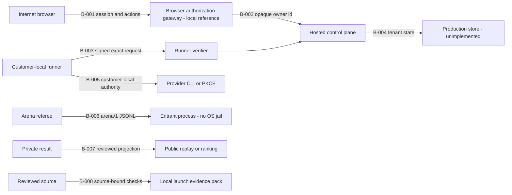

# BuilderWars launch threat model

Status: repository-grounded local security model for the protected public-beta launch path. This is not a production security approval. It does not authorize deployment, customer traffic, provider credential custody, public ranking, arbitrary hosted code, or a change to the BuilderWars.com apex.

## Executive summary

BuilderWars has a strong local reference foundation: exact schemas, tenant predicates, a fail-closed browser-authorization gateway, signed runner requests, durable nonce consumption, transactional lease and deletion behavior, deterministic replay, bounded publication projections, and source-bound local launch evidence. Those controls are real and testable, but the Clerk verifier, durable perimeter, production store, and deployment adapters do not yet exist.

The launch-critical exposure is production integration of browser authentication. The local gateway rejects request-supplied owner identifiers, requires exact origin and CSRF evidence, accepts only a freshly verified injected principal, derives the owner identifier with a server pepper, enforces strict route/body schemas, and fails closed when its injected account limiter is unavailable. A public service must still cryptographically verify the live Clerk session, provision the pepper, expose only the gateway, and supply durable edge/account controls. The second major boundary is untrusted execution: the current entrant sandbox is a process-lifecycle boundary, not an operating-system jail. Public arbitrary creator or entrant code must remain disabled until independent isolation evidence exists.

Seven high or critical threats remain protected holds: browser owner-mapping bypass, cross-tenant integration drift, entrant isolation escape, provider credential or cost abuse, publication poisoning, incomplete deletion or rollback, and source or verifier substitution. No customer has completed a protected tester journey, no production perimeter or store has been observed, and no public launch claim is made here.

## Scope and assumptions

In scope:

- The Mobile Arena, local browser-authorization gateway, future production Clerk adapter, hosted control-plane reference, transactional state, runner verifier, customer-local provider runner, arena referee and entrant boundary, publication pipeline, and local launch evidence builder.
- Authentication and authorization, tenant isolation, signed request replay resistance, pairing abuse, local provider authority, untrusted process isolation, result integrity, retention and recovery, availability, and release provenance.
- The transition from the current local reference implementation to a public multi-tenant beta.

Out of scope:

- Legal, privacy, trademark, provider-terms, and commercial acceptance.
- Cloud or Clerk dashboard configuration that cannot be observed from the repository.
- Security properties of provider applications, customer devices, DNS registrars, Vercel, Cloudflare, or other third parties beyond BuilderWars integration responsibilities.
- A claim that local tests prove production identity, traffic, capacity, deletion propagation, monitoring delivery, or customer success.

Assumptions:

1. The first protected release is a public multi-tenant beta rather than an internal-only service.
2. A production web adapter cryptographically verifies the Clerk session, constructs the reviewed principal input, and routes every owner command through the local gateway contract before calling framework-neutral handlers.
3. Provider credentials and subscription sessions stay customer-local; the hosted control plane never receives raw provider secrets.
4. Public arbitrary creator code and untrusted entrant execution remain disabled until an OS isolation profile is independently verified.
5. Production state is expected to replace the local SQLite reference while preserving its tenant and transaction invariants.

Open questions:

- What peak authenticated-user, runner, and public-spectator request rates define the beta capacity target?
- Which production regions, subprocessors, retention periods, and privacy obligations apply to the final data map?
- Will any launch phase admit third-party entrant or creator code, or only reviewed declarative games and customer-local harnesses?

## System model

### Primary components

| ID | Component | Security role | Current status |
| --- | --- | --- | --- |
| C-001 | Mobile Arena | Static local-first reader and builder shell | Implemented locally; demo fallback is not live truth |
| C-002 | Browser authorization gateway | Maps an injected verified principal to one opaque owner id and one exact owner command | Local reference implemented; production Clerk integration held |
| C-003 | Hosted control plane | Framework-neutral pairing, runner, job, deletion, and replay handlers | Reference implemented |
| C-004 | Hosted state store | Tenant, runner, nonce, lease, result, and projection state | Transactional SQLite reference only |
| C-005 | Runner verifier | Origin-bound Ed25519 verification and durable nonce consumption | Implemented locally |
| C-006 | Customer-local runner | Holds provider authority and invokes reviewed local adapters | Implemented locally |
| C-007 | Arena referee | Deterministic state, transcript, replay, and scoring | Implemented locally |
| C-008 | Entrant process boundary | JSONL subprocess channel, limits, and tree cleanup | Partial; explicitly not OS isolation |
| C-009 | Publication pipeline | Private review, source decision, bounded public projection | Implemented locally |
| C-010 | Launch evidence builder | Source-bound checks and protected launch holds | Implemented locally |

### Data flows and trust boundaries

| Boundary | Flow | Data and channel | Existing guarantees | Residual gap |
| --- | --- | --- | --- | --- |
| B-001 | Internet browser -> browser-authorization gateway | Session and customer actions over future HTTPS | Exact origin; canonical CSRF pair; strict routes/bodies; injected verified principal; owner-scoped local limiter reference | Production Clerk cookie/session verifier, edge controls, durable account limits, owner pepper, and idempotency unproven |
| B-002 | Browser-authorization gateway -> hosted control plane | Opaque owner id and bounded commands, in-process reference | HMAC-derived opaque owner id; no request owner id; canonical validation; uniform foreign-object errors | Live Clerk-subject binding and direct-handler non-exposure unproven |
| B-003 | Customer-local runner -> runner verifier | Signed exact method, path, body, origin, timestamp, and nonce over future HTTPS | Ed25519, origin binding, timestamp window, durable nonce consumption | TLS edge and perimeter limits unproven |
| B-004 | Hosted control plane -> hosted state | Tenant, runner, nonce, lease, job, and result state | Exact identifiers, parameterized queries, foreign keys, `BEGIN IMMEDIATE` | Production adapter, backup, restore, and capacity unproven |
| B-005 | Customer-local runner -> provider CLI or PKCE | Customer prompt and provider authority through local subprocess or pinned HTTPS | Explicit local intent, output bounds, redacted secret wrapper, pinned origin | Customer endpoint and broad native environments are not isolated; identity and billing unattested |
| B-006 | Arena referee -> entrant process | `arena/1` JSONL moves through stdin/stdout | Scratch cwd, environment allowlist, timeouts, output caps, tree cleanup | Network, filesystem, CPU, and memory are not confined |
| B-007 | Private result -> public projection | Offline receipts, replay digests, labels, and reviewed source | Exact schemas, replay verification, false attestations, separate source decision | Production reviewer identity, registry, and signing unproven |
| B-008 | Reviewed source -> launch evidence pack | Commit, tree, commands, file digests, and holds through local subprocess and JSON | Clean source, closed child environment, create-only output, canonical digest | Remote custody, deployment binding, served-byte parity, and detached signature unproven |

#### Diagram

## Assets and security objectives

| ID | Asset | Objectives | Why it matters |
| --- | --- | --- | --- |
| A-001 | Tenant principal-to-owner mapping | Integrity, confidentiality | A forged mapping enables cross-tenant control |
| A-002 | Pairing secrets, runner keys, and fingerprints | Confidentiality, integrity | They authorize durable runner enrollment and possession evidence |
| A-003 | Customer provider credentials, sessions, and billing authority | Confidentiality, integrity | Confused or exposed authority can compromise accounts or incur charges |
| A-004 | Tenant runner, nonce, lease, job, and result state | Integrity, availability | Integrity prevents replay, duplicate work, and tenant crossover |
| A-005 | Rules, transcripts, replays, scores, and receipt lineage | Integrity, availability | These records are the competitive truth |
| A-006 | Review, publication, ranking, and correction decisions | Integrity | Corruption can falsely promote or rank a result |
| A-007 | Source, bundles, verifier, dependencies, and launch evidence | Integrity, availability | Substitution invalidates downstream proof |
| A-008 | Compute capacity and customer cost budget | Availability, integrity | Abuse can deny service or create unbounded cost |
| A-009 | Deletion, rollback, incident, and audit receipts | Integrity, availability, confidentiality | They contain harm and prove recovery |

## Attacker model

### Capabilities

- Send unauthenticated requests to future browser, pairing, signed-runner, and public replay routes.
- Create a legitimate account and probe identifiers or race tenant-scoped state as a malicious customer.
- Control a paired runner or an entrant command and submit malformed, replayed, stale, oversized, adversarial, or internally inconsistent data.
- Supply a malicious harness, game definition, source bundle, receipt, review artifact, or dependency change.
- Exploit operator mistakes, stale deployments, incomplete data maps, weak monitoring, or mismatched source and served artifacts.
- Influence customer-local subprocess output and provider responses without being entitled to raw provider credentials.

### Non-capabilities

- The model does not assume compromise of Clerk, Cloudflare, Vercel, the underlying provider, or cryptographic primitives.
- The model does not assume physical access to customer devices or operator hardware.
- An attacker cannot currently reach a public hosted service from this repository alone; the production HTTP adapter and store do not exist here.
- Arbitrary public creator and entrant code is assumed disabled. Enabling it changes TM-005 likelihood from low to high immediately.

## Entry points and attack surfaces

| ID | Surface | Reached by | Boundary | Security note |
| --- | --- | --- | --- | --- |
| EP-001 | Owner-authenticated hosted commands | Verified browser-principal reference | B-001 | Create, confirm, revoke, delete, and fixture operations pass the local gateway but still require production Clerk verification |
| EP-002 | Pairing claim | One-time pairing secret | B-002 | Exact JSON claim, 600-second TTL, attempt lock, and one-winner transaction |
| EP-003 | Signed runner commands | Runner HTTPS request | B-003 | Probe, poll, renew, abandon, and result paths sign exact bytes |
| EP-004 | Public replay projection | Public job identifier | B-004 | Returns a bounded projection or not found |
| EP-005 | Customer-local provider runner | Local CLI and provider auth | B-005 | Provider authority stays on the customer machine |
| EP-006 | Arena entrant manifest | Reviewed subprocess command | B-006 | Untrusted commands are unsafe for shared hosting without a jail |
| EP-007 | Private review and source decision | Bounded offline artifacts | B-007 | Review does not directly publish |
| EP-008 | Local launch evidence builder | Reviewed source and bounded checks | B-008 | Local success leaves protected launch stages held |

## Top abuse paths

1. A production HTTP adapter bypasses the gateway or constructs its principal from unverified data, allowing an attacker to act as another tenant and revoke a runner, create jobs, or delete state (TM-001).
2. A production store port omits one owner predicate or transaction invariant, enabling cross-tenant reads or mutations despite safe reference behavior (TM-002).
3. A valid signed runner request is replayed against a deployment whose nonce store, origin binding, or exact-byte verification drifted (TM-003).
4. A public pairing endpoint is flooded or raced to lock legitimate challenges or bind an attacker-controlled key (TM-004).
5. A hosted arena executes an attacker command using only the current process boundary, enabling network, filesystem, CPU, memory, or descendant abuse (TM-005).
6. A malicious harness or verbose provider response leaks a customer credential or triggers an unapproved billed call (TM-006).
7. A forged receipt, mismatched source decision, or false provider/model attestation enters public ranking and social projection (TM-007).
8. Account deletion removes only the reference database row while leaving logs, queues, caches, analytics, backups, or public derivatives (TM-008).
9. Individually valid pairing, polling, result, or spectator requests exhaust database locks, queues, compute, or cost budgets (TM-009).
10. A served bundle, verifier, dependency set, or rollback artifact differs from the reviewed commit while retaining a stale success label (TM-010).

## Threat model table

| ID | Threat source | Prerequisites | Threat action | Impact | Existing controls | Residual gap | Recommended mitigation | Detection | Likelihood | Severity | Priority |
| --- | --- | --- | --- | --- | --- | --- | --- | --- | --- | --- | --- |
| TM-001 | Remote unauthenticated attacker | Production HTTP adapter exposes owner-scoped handlers and accepts an attacker-influenced owner id | Forge or confuse principal-to-owner mapping | Cross-tenant control, deletion, jobs, privacy breach | Gateway exact origin, canonical CSRF, strict routes/bodies, fresh injected principal, HMAC-derived owner, uniform foreign errors, fail-closed local limiter | Production Clerk/token/cookie wiring, durable edge/account limits, pepper custody, idempotency, and direct-handler non-exposure unproven | Verify Clerk server-side; construct only the reviewed principal; provision protected pepper and durable limits; expose only the gateway | Owner-mapping failures, foreign probes, destructive spikes, and redacted adapter decisions | Medium; high if production bypasses the gateway or trusts unverified principal data | High | Critical, protected hold |
| TM-002 | Authenticated malicious tenant | Production adapter weakens owner predicates | Enumerate identifiers and exploit an unscoped operation | Cross-tenant disclosure or mutation | SQLite owner predicates, foreign keys, atomic transactions | Production adapter and external multi-tenant test absent | Port invariants as adapter conformance tests; tenant-scoped keys; route fuzzing | Tenant-mismatch denials and destructive-operation anomalies | Low in reference; conditional on integration | High | High, protected hold |
| TM-003 | Network attacker or malicious runner | Captured signed bytes or verifier drift | Replay or redirect a valid command | Duplicate work, stale result, forged possession | Exact signed bytes, origin, timestamp, durable nonce | Production nonce store, edge, and TLS parity unproven | Preserve atomic nonce and canonical origin/path/body checks; reject redirects | Replay, stale, future, origin, signature, and nonce errors | Low | High | Medium |
| TM-004 | Remote attacker | Pairing route is public without layered limits | Guess, race, or flood pairing secrets | Enrollment denial or unauthorized binding | High entropy, hash-only storage, TTL, attempt lock, one-winner transaction | Edge, tenant, IP, and global limits absent | Layered durable limits and bounded retry-after | Claim failures, locks, races, distributed guessing | Medium | Medium | Medium |
| TM-005 | Malicious entrant or creator | Shared host runs attacker-controlled command | Access host capabilities or exhaust resources | Credential theft, host compromise, denial, lateral movement | Scratch cwd, env allowlist, timeout, caps, tree cleanup | No network, filesystem, CPU, memory, or POSIX escape confinement | Keep public code disabled; require disposable OS jail, egress controls, quotas, independent escape tests | Sandbox profile, limit exits, egress denials, orphan checks | Low while disabled; high when enabled | High | High, protected hold |
| TM-006 | Malicious artifact, compromised harness, or integration bug | Provider authority leaks through local execution or logs | Exfiltrate credentials or cause an unapproved billed call | Account compromise, charges, terms violation | Customer-local authority, secret wrapper, output bounds, pinned routes | Customer endpoint not isolated; consent, identity, and cost receipts unproven | Never serialize auth stores; fresh consent and cost ceiling; redact raw bodies; revoke compromised links | Customer-visible redacted route and cost receipts; hosted anomaly alerts without secrets | Medium | High | High, protected hold |
| TM-007 | Malicious runner, reviewer, or source contributor | Forged or mismatched artifact bypasses review | Publish an unattested result or lineage | False evaluations, unfair ranking, reputational harm | Replay verifier, exact schemas, bounded projection, false attestations, separate source decision | Reviewer identity, registry custody, detached signing absent | Require digest agreement; separately sign attestations; append-only corrections | Digest disagreements, replay failures, attestation escalation, correction bursts | Medium | High | High, protected hold |
| TM-008 | Operator error, integration bug, or malicious tenant | Production data spans unmodeled systems | Leave sensitive derivatives or delete the wrong state | Privacy harm, unavailable accounts, lost evidence | Atomic reference deletion; local recovery simulations; protected holds | Data map, policy, propagation, backup and restore unproven | Approve inventory; idempotent tenant deletion; retries and dead letters; supervised restore | Propagation lag, orphan counts, retry exhaustion, post-delete access | Medium | High | High, protected hold |
| TM-009 | Remote unauthenticated or authenticated attacker | Aggregate public controls are absent | Flood valid parsing, pairing, polling, result, or spectator paths | Outage, starvation, cost, delayed cleanup | Local body, attempt, lease, timestamp, and output bounds | Capacity target, concurrency, backpressure, perimeter and tenant quotas unproven | Edge and service quotas; bounded cache; fail-closed backpressure; target load test | Saturation, lock time, queue age, rejection, error and cost budgets | Medium | Medium | Medium |
| TM-010 | Supply-chain attacker or compromised contributor | Deployment differs from reviewed source | Substitute bundle, verifier, dependency, or configuration | False verification, unsafe execution or rollback | Deterministic locks, clean-source builder, create-only pack, canonical digests | Remote custody, signed provenance, served-byte parity and production signature absent | Bind all artifacts to commit/tree; signed create-only evidence; served-byte probes; rehearsed rollback | Compare served and verifier digests; dependency, tree, config drift alerts | Medium | High | High, protected hold |

## Criticality calibration

- Critical means the control must block protected deployment because one integration mistake can directly cross the tenant boundary. TM-001 is critical even though no current public adapter exists; its likelihood is conditional and its launch consequence is not.
- High means the potential impact includes tenant compromise, provider-account or financial harm, false competitive truth, unrecoverable privacy or evidence failure, host capability exposure, or invalidated release provenance.
- Medium means strong local controls reduce present exploitability or the expected impact is primarily bounded denial or enrollment disruption. These controls still require production parity tests.
- Likelihood ratings describe the current scoped design. They must be recalibrated when the adapter, production store, public traffic, provider routes, or arbitrary-code gate changes.

## Focus paths for security review

| Path | Review focus | Threats |
| --- | --- | --- |
| `provider_hub_hosted/browser_gateway.py` | Exact origin/CSRF, verified-principal contract, opaque owner derivation, strict routes, fail-closed limiter and errors | TM-001, TM-002, TM-004, TM-009 |
| `provider_hub_hosted/handlers.py` | External authentication boundary and destructive owner-scoped methods | TM-001, TM-002, TM-009 |
| `provider_hub_hosted/store.py` | Tenant predicates, transactions, nonces, leases, results, deletion | TM-002, TM-003, TM-004, TM-008, TM-009 |
| `provider_hub_hosted/verify.py` | Signature, origin, timestamp, owner, and nonce verification | TM-003 |
| `provider_hub/local_runner.py` | Pinned transport, exact signed bodies, customer-local authority | TM-003, TM-006 |
| `provider_hub/secrets.py` | Redaction, serialization refusal, explicit reveal sites | TM-006 |
| `arena/sandbox.py` | Process protocol, limits, cleanup, and explicitly unenforced isolation | TM-005, TM-009 |
| `arena/process_tree.py` | Descendant lifecycle without capability confinement | TM-005 |
| `publishing/promotion.py` | Review projection bounds and false attestations | TM-006, TM-007 |
| `publishing/source_decision.py` | Separate source admission and mutation authority | TM-007, TM-010 |
| `publishing/retention_recovery.py` | Deletion, suppression, recovery, rollback truth | TM-008, TM-010 |
| `bin/build_agentwars_local_launch_evidence.py` | Source custody, bounded child environment, protected holds | TM-008, TM-010 |
| `provider_hub_hosted/tests/test_control_plane.py` | Tenant, replay, race, rollback, and cleanup conformance | TM-001, TM-002, TM-003, TM-004, TM-008, TM-009 |

## Production gates and evidence boundary

The executable model in `publishing/threat_model.py` and checker in `bin/check_builderwars_threat_model.py` validate repository anchors, risk ordering, threat coverage, hostile contract mutations, false production authority, and exact source identity. Their success means the local model is internally consistent for the checked commit. It is not a production security approval.

The following remain protected gates:

1. Production Clerk verification, principal-to-owner mapping, owner pepper custody, durable browser rate limits, idempotency, and adapter-only gateway wiring.
2. Production store tenant, transaction, lease, deletion, and nonce conformance.
3. Durable edge, service, and tenant rate limits with a named capacity target.
4. Production secret boundary, customer provider consent, route identity, and cost receipts.
5. OS-level isolation for untrusted code, or continued disablement of that capability.
6. Monitoring delivery, alert thresholds, incident staffing, and exercised response.
7. Complete data map, retention policy, deletion propagation, external backup, and restore proof.
8. Source-bound deployment, served-byte parity, production configuration identity, and rollback rehearsal.
9. External penetration review and separate accountable security acceptance.

Local work has no authority to accept provider terms, attest human action, change protected Clerk or Cloudflare configuration, modify the BuilderWars.com apex or `www`, or skip a blocking check. A green local pack must remain held until production evidence is independently attached to the same source.

## Quality check

- Repository anchors cover every modeled component, boundary, entry point, and existing-control claim.
- Every trust boundary, asset, and entry point appears in at least one threat.
- Likelihood and impact are separated, and conditional exposure is stated rather than implied.
- High and critical threats require protected holds; local success cannot flip production authority.
- Secret custody, tenant isolation, arbitrary execution, public ranking, deletion, availability, and supply-chain risks are represented.
- Assumptions and unanswered production questions are explicit.
- The threat model is useful for launch review but intentionally refuses to claim customers, traffic, security acceptance, or production readiness.

The browser boundary, adapter checklist, focused adversarial command, and rollback expectations are specified in [`AGENTWARS_BROWSER_AUTHORIZATION_BOUNDARY.md`](AGENTWARS_BROWSER_AUTHORIZATION_BOUNDARY.md). The executable model binds 17 exact source anchors; all production authority remains false.
