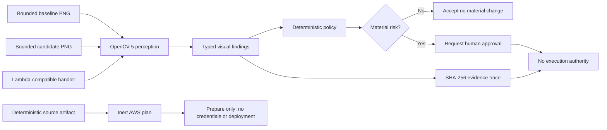

# Sightline Architecture — Draft, Not Submitted

A self-contained companion rendering is stored in `ARCHITECTURE.draft.svg`. It contains no external fonts, scripts, images, links, or network references.

## Trust Boundaries

- Image inputs are bounded and decoded locally.
- OpenCV findings are data, not execution authority.
- The decision engine has no mutation or deployment tool.
- The AWS plan is metadata only and cannot execute.
- Credential, deployment, and spend authority must remain false.
- Judge-facing materials exclude secrets, customer data, and private operational details.
